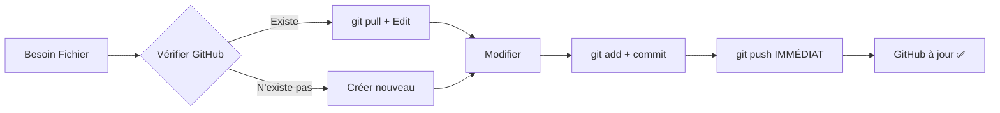

# 🌐 GITHUB FIRST - POLITIQUE OBLIGATOIRE
# TOUTE IA DOIT SUIVRE CE WORKFLOW SANS EXCEPTION

## 🚨 RÈGLE ABSOLUE: GITHUB EST LA SEULE SOURCE DE VÉRITÉ

### 📋 WORKFLOW OBLIGATOIRE POUR TOUTE OPÉRATION

#### 1️⃣ AVANT CHAQUE SESSION
```bash
# OBLIGATOIRE - Synchroniser avec GitHub
git pull origin main

# Vérifier statut
git status
```

#### 2️⃣ AVANT CRÉATION DE FICHIER
```bash
# Option A: API GitHub (recommandé)
curl -s "https://api.github.com/repos/fvegiard/pgi-ia/contents/[path/to/file]" | grep "name"

# Option B: Vérifier tout un dossier
curl -s "https://api.github.com/repos/fvegiard/pgi-ia/contents/[folder]" | jq '.[].name'

# Option C: Recherche globale
curl -s "https://api.github.com/repos/fvegiard/pgi-ia/git/trees/main?recursive=1" | grep -i "[filename]"
```

#### 3️⃣ AVANT MODIFICATION
```bash
# Récupérer dernière version GitHub
curl -s "https://raw.githubusercontent.com/fvegiard/pgi-ia/main/[path/to/file]" > temp_github_version.txt

# Comparer avec local
diff [local_file] temp_github_version.txt
```

#### 4️⃣ APRÈS CHAQUE MODIFICATION
```bash
# Commit immédiat
git add [file]
git commit -m "Description précise"

# Push immédiat (évite désynchronisation)
git push origin main
```

## 🛠️ SCRIPTS AUTOMATIQUES DE VÉRIFICATION

### check_github_first.sh
```bash
#!/bin/bash
# Script à exécuter AVANT tout travail

echo "🌐 GITHUB FIRST CHECK..."

# 1. Pull latest
echo "📥 Synchronisation GitHub..."
git pull origin main

# 2. Afficher fichiers modifiés localement
echo "📝 Fichiers locaux modifiés:"
git status --short

# 3. Afficher derniers commits GitHub
echo "📜 Derniers commits GitHub:"
git log --oneline -5

# 4. Vérifier connexion API GitHub
echo "🔗 Test API GitHub..."
curl -s "https://api.github.com/repos/fvegiard/pgi-ia" | grep "full_name"

echo "✅ GitHub First Check terminé!"
```

### verify_file_exists.sh
```bash
#!/bin/bash
# Usage: ./verify_file_exists.sh path/to/file

FILE_PATH=$1
API_URL="https://api.github.com/repos/fvegiard/pgi-ia/contents/$FILE_PATH"

echo "🔍 Vérification sur GitHub: $FILE_PATH"

RESPONSE=$(curl -s "$API_URL")
if echo "$RESPONSE" | grep -q "\"name\""; then
    echo "✅ FICHIER EXISTE sur GitHub!"
    echo "$RESPONSE" | jq '{name, size, sha}'
    echo "⚠️  NE PAS RECRÉER - Utiliser Edit!"
else
    echo "❌ Fichier n'existe pas sur GitHub"
    echo "✅ Création autorisée"
fi
```

## 📊 TABLEAU DE BORD GITHUB

### Liens Rapides
- **Repo**: https://github.com/fvegiard/pgi-ia
- **Fichiers**: https://github.com/fvegiard/pgi-ia/tree/main
- **Frontend**: https://github.com/fvegiard/pgi-ia/tree/main/frontend
- **Backend**: https://github.com/fvegiard/pgi-ia/tree/main/backend
- **Commits**: https://github.com/fvegiard/pgi-ia/commits/main

### API Endpoints Utiles
```bash
# Structure complète
https://api.github.com/repos/fvegiard/pgi-ia/git/trees/main?recursive=1

# Contenu fichier
https://raw.githubusercontent.com/fvegiard/pgi-ia/main/[path]

# Métadonnées fichier
https://api.github.com/repos/fvegiard/pgi-ia/contents/[path]
```

## ⚠️ ERREURS À ÉVITER

### ❌ INTERDIT
- Créer sans vérifier GitHub
- Se fier uniquement au local
- Ignorer `git pull`
- Retarder les commits/push

### ✅ OBLIGATOIRE  
- GitHub first TOUJOURS
- `git pull` avant travail
- Vérifier API avant création
- Commit + push immédiat

## 🔄 CYCLE DE VIE FICHIER



## 📝 CHECKLIST QUOTIDIENNE

- [ ] `git pull origin main` au début
- [ ] Vérifier GitHub avant CHAQUE fichier
- [ ] Utiliser API GitHub pas `ls` local
- [ ] Commit après CHAQUE modification
- [ ] Push IMMÉDIATEMENT
- [ ] `git status` clean avant fin session

---
**Cette politique est NON-NÉGOCIABLE et OBLIGATOIRE pour TOUTE IA**